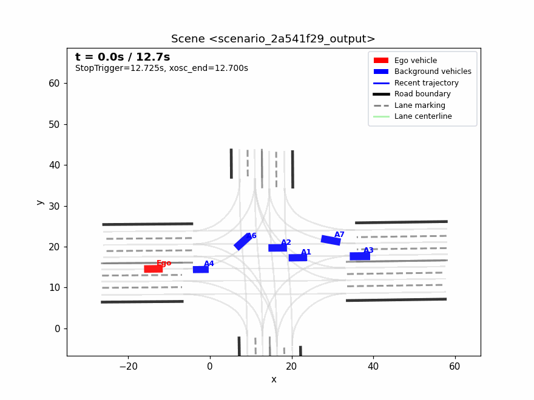
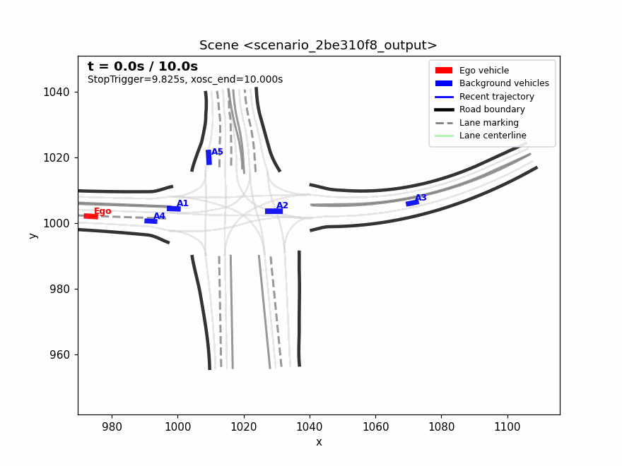
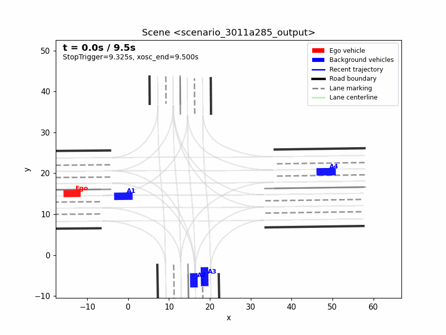
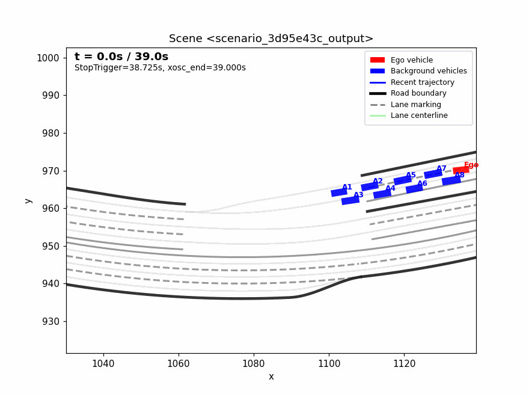
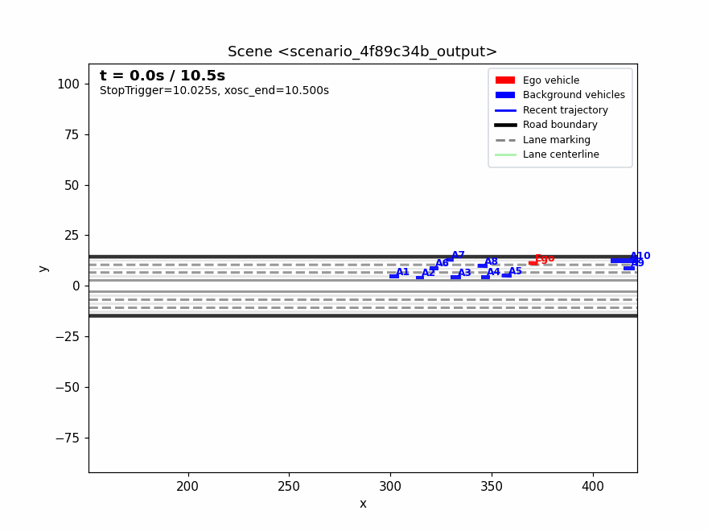
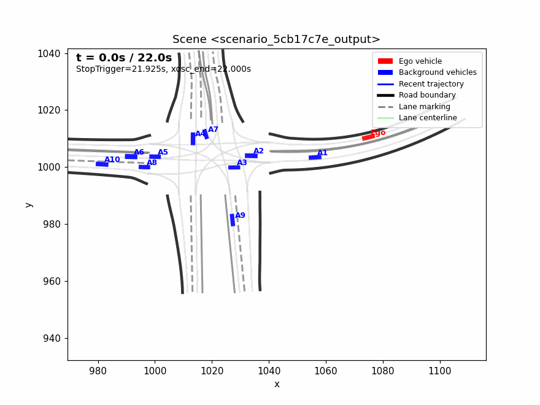

<div align="center">
<a href="https://onsite.com.cn/">
    
</a>

# OnSite Unified Train-Test Scenario Generation Track Baseline: Data-Driven Simulation Scenario Generation for Autonomous Driving

<p>
  <strong>English</strong> · <a href="README_zh.md">中文</a>
</p>
</div>

<div align="center">
<a href="https://onsite.com.cn/"></a>
&nbsp;&nbsp;&nbsp;&nbsp;
<a href="https://tops.tongji.edu.cn/"></a>
&nbsp;&nbsp;&nbsp;&nbsp;

</div>

## Overview

This repository provides an implementation for the **OnSite Unified Train-Test Scenario Generation Track**, with a focus on data-driven simulation scenario generation for autonomous driving evaluation. Given historical traffic states from an input OpenSCENARIO file and the corresponding OpenDRIVE road network, the framework uses an **adapted data-driven multi-agent behavior generation model** to predict **background-vehicle** behaviors and exports submission-ready `*_output.xosc` files following the OnSite format. The **ego vehicle is not simulated**; only its historical trajectory from the input scenario is retained.

In addition to batch scenario generation, this repository includes a lightweight visualization pipeline that renders `xosc + xodr` pairs into GIF animations. The visualization utility is designed to facilitate qualitative inspection of generated background-vehicle behaviors, road-network consistency, off-road deletion logic, and overall scenario validity.

<p align="center">
  
  &nbsp;
  
  &nbsp;
  
</p>

<p align="center">
  
  &nbsp;
  
  &nbsp;
  
</p>

<p align="center"><em>The ego vehicle is not simulated by the model; its trajectory in the GIF replays the historical states from the input scenario only. Background vehicles are generated and simulated by the model.</em></p>

## Highlights

- **Data-driven scenario generation.** The framework generates background-vehicle trajectories from historical observations and map information. Ego trajectories are taken directly from the input scenario and are not regenerated.
- **OpenSCENARIO-compatible output.** Generated trajectories are written into `*_output.xosc` files that are compatible with the OnSite submission protocol.
- **OpenDRIVE-aware inference.** Road-network information is parsed from `.xodr` files and incorporated into the scenario construction and inference process.
- **Batch processing support.** Multiple test scenarios can be processed automatically with a unified command-line interface.
- **GIF-based qualitative validation.** The visualization script supports static and following camera modes, map- or trajectory-centered views, and visualization of vehicle deletion events.

## Table of Contents

- [1. Environment Setup](#1-environment-setup)
- [2. Data Preparation](#2-data-preparation)
- [3. Repository Structure](#3-repository-structure)
- [4. Scenario Generation](#4-scenario-generation)
- [5. Visualization](#5-visualization)
- [6. Acknowledgements](#6-acknowledgements)

## 1. Environment Setup

Create and activate the Conda environment:

```bash
conda create -y -n onsite python=3.11.9
conda activate onsite
conda install -y -c conda-forge ffmpeg=4.3.2
pip install -r requirements.txt
pip install torch_geometric
pip install torch_scatter torch_cluster -f https://data.pyg.org/whl/torch-2.4.0+cu121.html
pip install --no-deps waymo-open-dataset-tf-2-12-0==1.6.4
```

> **Note.** The exact PyTorch Geometric wheel should be selected according to the local PyTorch and CUDA versions. CUDA 11.3, 11.6, and 11.8 have been tested in previous configurations, but users may need to adjust dependencies for their own hardware and driver environments.

## 2. Data Preparation

Each test scenario should contain one OpenSCENARIO file and one OpenDRIVE road-network file. The recommended directory structure is:

```text
data/B/
└── scenario_xxx/
    ├── scenario_xxx_exam.xosc      # Input scenario containing historical states of ego and background vehicles
    └── scenario_xxx.xodr           # OpenDRIVE road-network file
```

Model checkpoints are expected to be placed under the `ckpt/` directory. An example checkpoint path is shown below:

```text
ckpt/epoch=07-step=30440-val_loss=2.52.ckpt
```

## 3. Repository Structure

### 3.1 Repository Layout

```text
SMART-Onsite/
├── onsite_gen.py                   # Batch generation of *_output.xosc files
├── visualize_xosc_gif.py           # GIF visualization for xosc + xodr scenarios
├── inference.py                    # Core inference and map-parsing interface
├── requirements.txt                # Python dependencies
├── README.md                       # English documentation
├── README_zh.md                    # Chinese documentation
├── asset/                          # Logos and demo GIFs used in the README
├── configs/validation/             # Model validation configuration files
├── ckpt/                           # Model checkpoint directory
├── data/B/                         # Topic B input test scenarios
├── results/                        # Evaluation summaries and per-scene score details
│   ├── summary_averages_100.csv    # Aggregated average scores
│   ├── per_scene_detailed_100.csv  # Per-scene detailed scores
│   └── evaluation/                 # Closed-loop evaluation outputs
├── smart/                          # Adapted model implementation
└── utils/opendrive2discretenet/    # OpenDRIVE road-network parsing utilities
```

### 3.2 Core Scripts

| File | Description |
|:---:|:---|
| `onsite_gen.py` | Reads `*_exam.xosc` files in batch, generates background-vehicle behaviors with the adapted model, and writes the generated trajectories into `*_output.xosc` files. |
| `visualize_xosc_gif.py` | Renders single or multiple `xosc + xodr` scenarios into GIF animations, with support for legends, fixed-view visualization, and deleted-vehicle display logic. |
| `inference.py` | Provides the low-level interface for model inference, road-network parsing, and scenario-data construction. |
| `requirements.txt` | Lists the Python dependencies required by this repository. |

## 4. Scenario Generation

### 4.1 Batch Generation

Run the following command to generate `*_output.xosc` files for all scenarios in the test directory:

```bash
python onsite_gen.py \
  --test_dir data/B \
  --output_dir scene_sub \
  --ckpt_path ckpt/epoch=07-step=30440-val_loss=2.52.ckpt \
  --sampling_mode greedy \
  --seed 2026 \
  --road_exit_distance 5.0
```

The main arguments are summarized as follows:

| Argument | Description |
|:---|:---|
| `--test_dir` | Root directory of the input test scenarios. Each subdirectory should contain a `*_exam.xosc` file and the corresponding `.xodr` file. |
| `--output_dir` | Directory in which generated `*_output.xosc` files will be saved. |
| `--ckpt_path` | Path to the adapted model checkpoint. |
| `--sampling_mode` | Inference sampling strategy. `greedy` is recommended for deterministic and reproducible generation. |
| `--road_exit_distance` | Distance threshold from the lane centerline used to trigger background-vehicle deletion when a vehicle leaves the valid road region. |

#### Expected Results

The table below reports the **expected evaluation scores** of this baseline on **Topic B** (`450` scenes), using the default checkpoint and `greedy` sampling. Scores are averaged across all evaluated scenes.

| Metric | Value |
|:---|---:|
| Topic | B |
| Scene Count | 450 |
| BV Safety (20) | 18.178 |
| BV Comfort (10) | 6.393 |
| BV Test (30) | 7.963 |
| **BV Total (60)** | **32.533** |
| AV Safety (10) | 4.515 |
| AV Efficiency (10) | 3.838 |
| AV Comfort & Traffic Coordination (5 + 5) | 4.659 |
| AV Compliance (10) | 3.781 |
| **AV Total (40)** | **16.792** |
| **Total Score (100)** | **49.325** |

> **Note.** `BV` denotes background-vehicle evaluation (60 points), and `AV` denotes autonomous-vehicle closed-loop evaluation (40 points). The ego vehicle is not simulated during scenario generation; only its historical trajectory from the input scenario is retained.

### 4.2 Debugging on a Limited Number of Scenarios

For quick debugging or sanity checks, use the `--limit` argument:

```bash
python onsite_gen.py \
  --test_dir data/B \
  --output_dir scene_sub \
  --ckpt_path ckpt/epoch=07-step=30440-val_loss=2.52.ckpt \
  --sampling_mode greedy \
  --seed 2026 \
  --limit 10
```

## 5. Visualization

### 5.1 Batch Visualization

```bash
python visualize_xosc_gif.py \
  --scene_dir scene_sub \
  --xodr_root data/B \
  --output_dir scene_sub/gifs \
  --camera static \
  --view traj \
  --padding 4
```

### 5.2 Single-Scenario Visualization

```bash
python visualize_xosc_gif.py \
  --xosc_path scene_sub/scenario_xxx_output.xosc \
  --xodr_path data/B/scenario_xxx/scenario_xxx.xodr \
  --output_gif scene_sub/gifs/scenario_xxx_output.gif \
  --camera static \
  --view traj \
  --padding 4
```

### 5.3 Visualization Arguments

| Argument | Description |
|:---|:---|
| `--camera static` | Uses a fixed camera view. This option is recommended for stable visual inspection and avoids camera jitter caused by following vehicles. |
| `--camera follow` | Uses a vehicle-following view, which is useful for local behavior inspection. |
| `--view traj` | Determines the canvas according to the active vehicle trajectories, providing a compact view of the generated scenario. |
| `--view map` | Determines the canvas according to the complete road network, which is useful for inspecting global map structure. |
| `--view both` | Considers both vehicle trajectories and the full road-network extent when determining the visualization region. |
| `--padding` | Controls the visual margin around the selected canvas. Smaller values provide a more focused view. Typical values range from `2` to `6`. |

By default, the visualization script uses an `8:6` canvas and displays a legend. The script also parses `DeleteEntityAction` records from the OpenSCENARIO file, so background vehicles that are removed from the scenario will disappear from the GIF after the corresponding deletion time.

## 6. Acknowledgements

This work was supported by the Department of Engineering and Materials Sciences of the National Natural Science Foundation of China and the China Society of Automotive Engineers. The authors also gratefully acknowledge the collective contributions of the [TOPS Research Group](https://tops.tongji.edu.cn/index.htm). This repository adapts and extends the [SMART](https://github.com/rainmaker22/SMART) project, whose open-source implementation provided an important technical foundation for this work.
